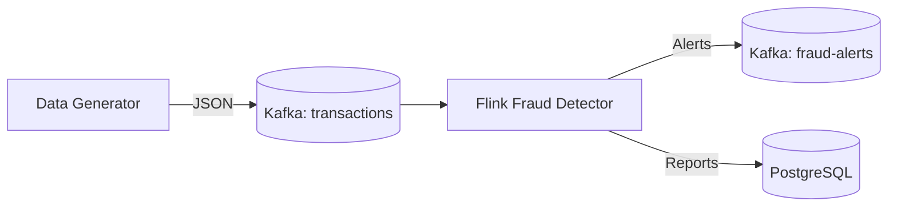

# Building a Real-Time Fraud Detection System with Apache Flink, Kafka, and PostgreSQL

*In the world of digital finance, milliseconds matter. Here is how to build a robust fraud detection engine using open-source streaming technologies.*

---

Fraud detection is the "Hello World" of stream processing for a reason: it requires low latency, stateful computation, and the ability to handle infinite streams of data. In this article, we'll walk through building a production-grade fraud detection pipeline using **Apache Flink**, **Kafka**, and **PostgreSQL**.

## The Architecture

Our system follows a classic streaming architecture:

1.  **Ingestion**: Transaction data is pushed to a Kafka topic (`transactions`).
2.  **Processing**: A Flink job consumes these transactions, applies stateful rules to detect patterns, and emits alerts.
3.  **Action**: Fraud alerts are sent to a separate Kafka topic (`fraud-alerts`) for immediate action and sinked to PostgreSQL for reporting.



## The Infrastructure

We use Docker Compose to spin up our local environment. This ensures we have a reproducible infrastructure containing:
-   **Kafka (KRaft mode)**: For message brokering without Zookeeper.
-   **Flink Cluster**: A JobManager and TaskManagers for executing our code.
-   **PostgreSQL**: For persistent storage of fraud reports.
-   **Conduktor**: A UI to visualize our Kafka topics.

## The Fraud Detection Logic

The core of our application is the **Stateful Fraud Detection**. We aren't just looking at single transactions in isolation (stateless); we are looking for *patterns* over time.

### The Pattern: "Card Testing"
A common fraud strategy is "card testing":
1.  A fraudster tests a stolen card with a very small amount (e.g., < $1.00).
2.  If it succeeds, they immediately follow up with a large transaction (e.g., > $500.00).

To detect this, we need to **remember** the previous transaction for every single account. This is where Flink's `ValueState` shines.

### Implementation in Flink (Java)

We implement a `KeyedProcessFunction` that keys the stream by `accountId`. This ensures all transactions for the same account are processed by the same parallel task, allowing us to maintain local state.

```java
public class AdvancedStatefulFraudDetectionProcessor 
    extends KeyedProcessFunction<String, Transaction, FraudAdvancedAlert> {

    // State to hold the previous transaction for this key (account)
    private transient ValueState<Transaction> previousTransactionState;

    @Override
    public void open(Configuration parameters) {
        // Define the state descriptor
        ValueStateDescriptor<Transaction> descriptor = 
            new ValueStateDescriptor<>("previous-transaction", Transaction.class);
        previousTransactionState = getRuntimeContext().getState(descriptor);
    }

    @Override
    public void processElement(Transaction transaction, Context context, Collector<FraudAdvancedAlert> out) throws Exception {
        // Retrieve the previous transaction from state
        Transaction previousTransaction = previousTransactionState.value();

        // The Rule: Small (< 100) followed by Large (> 50,000)
        if (previousTransaction != null) {
            if (previousTransaction.amount() < 100.00 && transaction.amount() > 50000.00) {
                // Pattern detected!
                FraudAdvancedAlert alert = buildAlert(transaction, previousTransaction);
                out.collect(alert);
                
                // Clear state to avoid double alerting on the same sequence
                previousTransactionState.clear();
                return;
            }
        }

        // Update state for the next transaction
        previousTransactionState.update(transaction);
    }
}
```

## Why State Matters

If we tried to do this with a stateless microservice (e.g., a simple Python consumer), we would need to query an external database (like Redis or Postgres) for every single transaction to fetch the "last transaction".

*   **Stateless approach**: 10,000 transactions/sec = 10,000 DB reads + 10,000 DB writes. Latency spikes, database melts.
*   **Flink Stateful approach**: State is stored locally in memory (or RocksDB) on the TaskManager. Access is near-instantaneous. Flink handles the fault tolerance (checkpointing) automatically.

## Conclusion

By leveraging Flink's stateful capabilities, we built a fraud detector that scales linearly. We don't need a separate database for intermediate state, and we can handle complex patterns that span time windows.

In the next article, we will explore the developer experience differences between implementing this in Java vs. Python (PyFlink).

